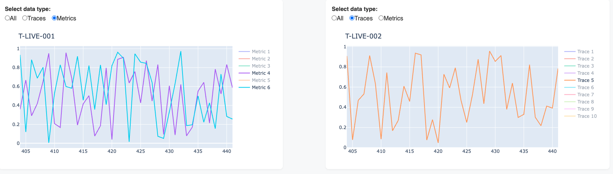

# MTV – Multi Test Viewer

**Multi Test Viewer** is an MVP version of a test execution analysis dashboard.  
It provides interactive visualizations of time-series (`Trace`) and aggregated (`Metric`) test data from CSV files, allowing users to explore results "efficiently".

This project was created as a prototype to demonstrate key features of a robust testing analytics platform using Dash and FastAPI.

---
## 📚 Table of Contents

- [MTV – Multi Test Viewer](#mtv--multi-test-viewer)
  - [📚 Table of Contents](#-table-of-contents)
  - [🖼️ Dashboard Previews](#️-dashboard-previews)
    - [🔹 Home View](#-home-view)
      - [📈 Metric Selection and Graph Type Toggle](#-metric-selection-and-graph-type-toggle)
      - [🔄 Real-Time WebSocket Execution Flow](#-real-time-websocket-execution-flow)
    - [📉 Trace Page](#-trace-page)
    - [📈 Metrics Page](#-metrics-page)
    - [🧾 Table Page](#-table-page)
    - [🧾 Charts Below Table View](#-charts-below-table-view)
  - [✨ Key Features](#-key-features)
  - [🔧 Technologies](#-technologies)
  - [🚀 Getting Started](#-getting-started)
    - [🐍 Option 1: Using Python `venv` + `pip`](#-option-1-using-python-venv--pip)
      - [▶️ Linux / macOS](#️-linux--macos)
      - [▶️ Windows](#️-windows)
    - [⚡ Option 2: Using UV Package Manager](#-option-2-using-uv-package-manager)
  - [🛠️ TODO](#️-todo)

---

## 🖼️ Dashboard Previews
Below are screenshots demonstrating key views and functionalities of the Multi Test Viewer Dashboard, built with Plotly Dash. The dashboard supports real-time test data visualization, trace and metric analysis, and interactive test filtering.

### 🔹 Home View
Simulates live test execution using WebSocket communication. Visual indicators update in real-time, reflecting incoming test data streams.


#### 📈 Metric Selection and Graph Type Toggle
Users can interactively select which test metrics to display, and switch between various graph types (e.g., line, bar) for flexible data analysis.


#### 🔄 Real-Time WebSocket Execution Flow
A dynamic flow diagram visualizes the lifecycle of test execution, showcasing the flow of messages and test phases in real time.


### 📉 Trace Page
Visualizes time-series traces from selected test cases. Supports overlaying multiple traces on a single plot, with interactive tooltips showing statistical summaries (avg, std, min, max).


### 📈 Metrics Page
Displays metric results across tests. Under each graph, a summary section aggregates the selected tests for quick comparison. Users can compare multiple metrics simultaneously and see relative performance.


### 🧾 Table Page
Provides a comprehensive table summarizing test results, including parameters, trace statistics, and metric values. Clicking a row displays corresponding charts below the table.


### 🧾 Charts Below Table View
When one or more tests are selected from the table, their data is visualized directly below, enabling focused analysis of selected results.


## ✨ Key Features

- 📊 **Three dedicated dashboard pages** for different types of analysis:
  - Time-series `Trace` visualizations with stats (avg, std, min, max)
  - Comparative `Metric` analysis with difference visualization (e.g., +50%, -30%)
  - Interactive summary table with selectable test details
- 🧠 **Dynamic charts** – add/remove metrics and traces on the fly
- 🔍 **Test parameter filtering**
- 🔗 **Sharable URLs** with full dashboard state (filters, selections, views)
- 🔁 **Real-time synchronization** with file-based data changes
- 🧩 Modular architecture: Dash frontend + FastAPI backend
- 🌐 **REST API** support for fetching data
- 🔌 **WebSocket connection** for real-time interactivity

---

## 🔧 Technologies

- Python 3
- [Dash by Plotly](https://dash.plotly.com/)
- [FastAPI](https://fastapi.tiangolo.com/)
- Pandas
- Plotly
- Uvicorn

---

## 🚀 Getting Started

You can run the project using one of the following options:
- **Standard Python** (with `venv` + `pip`)
- **UV Package Manager** (fast alternative to pip + venv)

---

### 🐍 Option 1: Using Python `venv` + `pip`

#### ▶️ Linux / macOS

```bash
# 1. Create virtual environment
python3 -m venv venv
source venv/bin/activate

# 2. Install dependencies
pip install -r requirements_dev.txt

# 3. Run backend
python -m uvicorn backend.main:app --reload --host 127.0.0.1 --port 8000

# 4. In a new terminal: run frontend
source venv/bin/activate
python -m mtv_dashboard.main
```

#### ▶️ Windows

``` bash
# 1. Create virtual environment
python -m venv venv
venv\Scripts\activate

# 2. Install dependencies
pip install -r requirements_dev.txt

# 3. Run backend
python -m uvicorn backend.main:app --reload --host 127.0.0.1 --port 8000

# 4. In a new terminal: run frontend
venv\Scripts\activate
python -m mtv_dashboard.main
```

---
### ⚡ Option 2: Using UV Package Manager
> [UV ](https://github.com/astral-sh/uv)is a fast and modern Python package manager that replaces both `pip` and `venv`.

```bash
# 1. Create virtual environment using UV and install dependencies

uv sync

# 2. Run backend and frontend parallel

uv run uvicorn backend.main:app --reload --host 127.0.0.1 --port 8000 & uv run -m mtv_dashboard.main
```

---

## 🛠️ TODO

- [ ] Connect WebSocket **only** on the home page to reduce overhead.
- [x] Adjust chart dimensions – current layout renders them too small.
- [x] Add rolling window on homepage. 
- [ ] Improve sharable link mechanism:
  - [x] **Current:** Populate charts using route path parameters.
  - [ ] **Planned:** Store chart state in a database and generate a short sharable link that maps to saved data.
